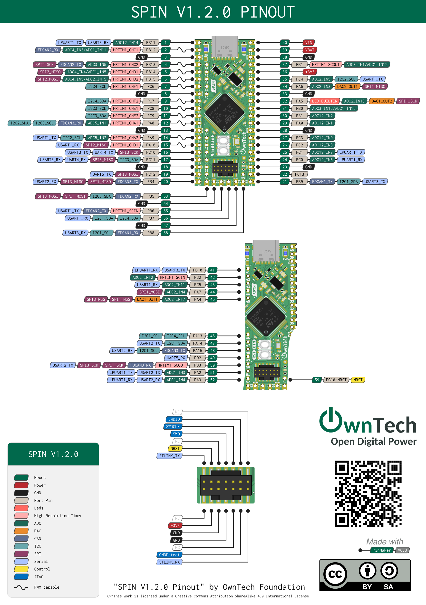
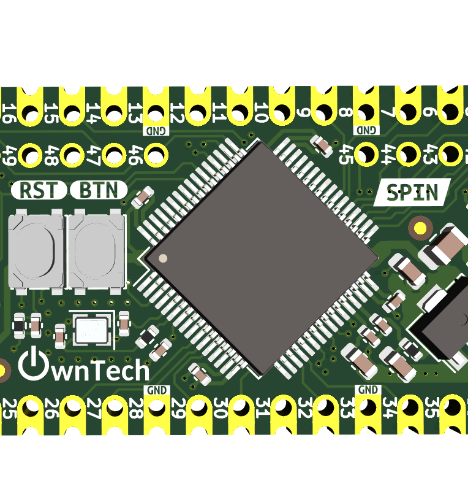
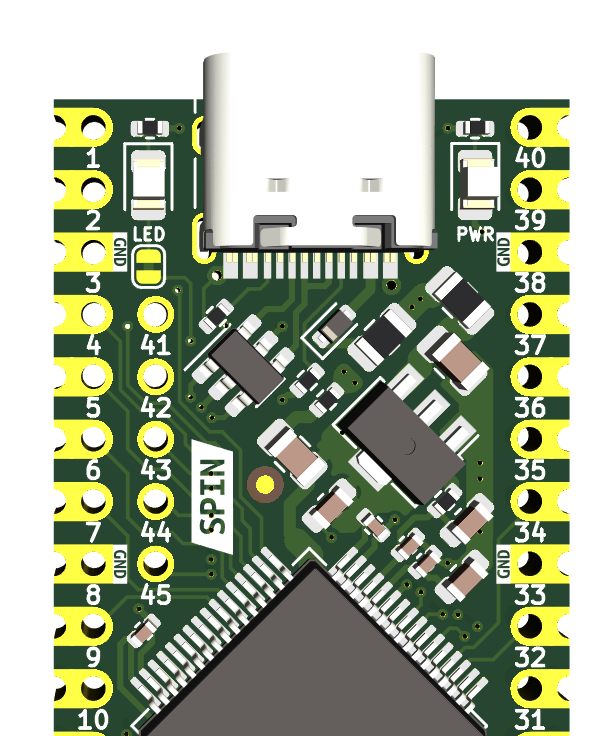
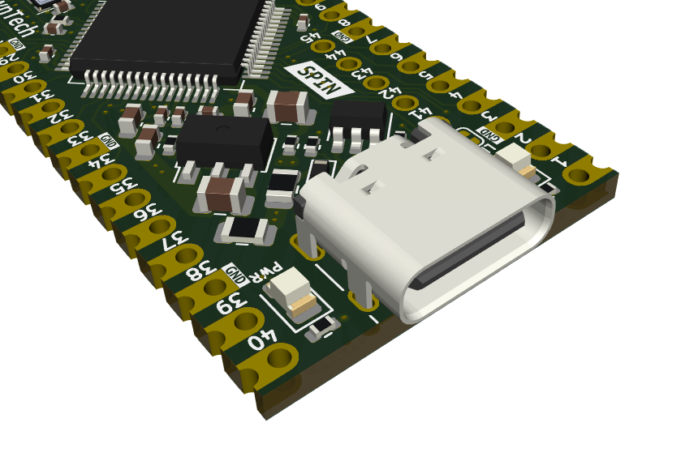
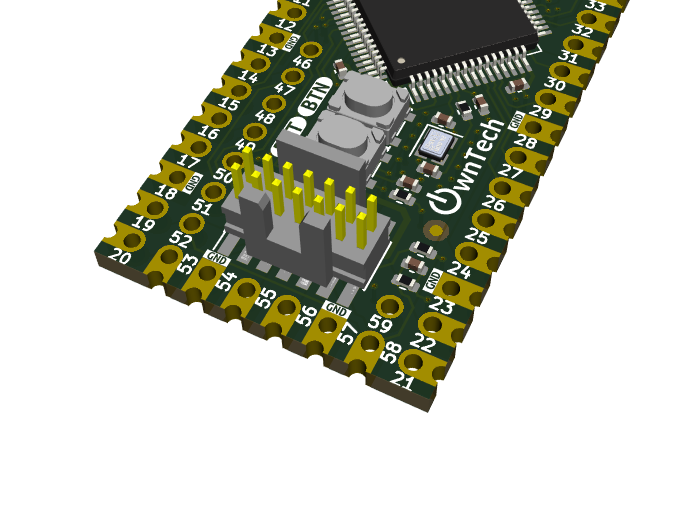

# SPIN V1.2 Documentation

!!! note 
    This page is version specific. Make sure that your board version matches before reader further.  

## Schematics

You can check out the Schematics and PCB Layout on 

## Pinout

!!! info "Powerful Microcontroller made for digital power applications"
    The main element of the spin board is the powerful **STM32G474** microcontroller.  
    It is meant to be used for digital power applications, and has complex and versatile 
    analog peripherals, that can be paired with digital PWMs signals.  
    Aside from the microcontroller there are two buttons.  

    * Reset **RST** – Reset the board  
    * Button **BTN** – Connected to PC14, can be used for user-defined applications  

    Pressing both buttons simultaneously resets the microcontroller into **RECOVERY** mode, allowing safe reprogramming even if the device is unresponsive.  

    { width="300" align=left }

!!! info "Onboard LEDs - Intuitive silkscreen"

    Two LEDs are present onboard.  

    * **PWR LED** indicates power presence.  
    * **User LED** connected to PA5 can be used for application development.  

    !!! note 
        The User **LED** can be disconnected via the onboard solder jumper if PA5 is required for other purposes.  

    !!! tip
        A dim or flickering **PWR** LED may indicate insufficient or unstable power supply.  
        If the SPIN board is mounted on a power shield, check the upstream source for issues.  

    Silkscreen marking  

    * is squared for GND pins  
    * and round for any other signal.  

    { width="300" align=left }

!!! info "Native USB support"
    The onboard USB-C port supports both microcontroller programming and serial communication, 
    and is protected against electrostatic discharge.  

    { width="300" align=left }

!!! info "Debugger port"
    This connector allows to connect an STLINK debugger.  
    Having a dedicated debugger permits advanced tracing, and using breakpoints in the code.  

    { width="300" align=left }

## Recovery Mode

The SPIN board has a **RECOVERY** mode. This mode permits to restore a known to work program, when 
the board is stuck.  
In recovery mode, flashing the board is not different from a regular flash.  

There are 3 ways to enter recovery mode.  

=== "Using onboard buttons"

    Pressing simultaneously **BTN** and **RST** will reboot the board in **RECOVERY** mode.  

=== "Using serial port"

    Connecting to the serial port at 1200Baud will trigger a reboot callback that will place
    the microcontroller in recovery mode.  

=== "Using code"

    1. Drive PC14 high in software  
    2. Trigger a software reset  

    Setting PC14 pin to high state, will load a small onboard capacitance, similar to the pressing 
    action on the **BTN** button.  

